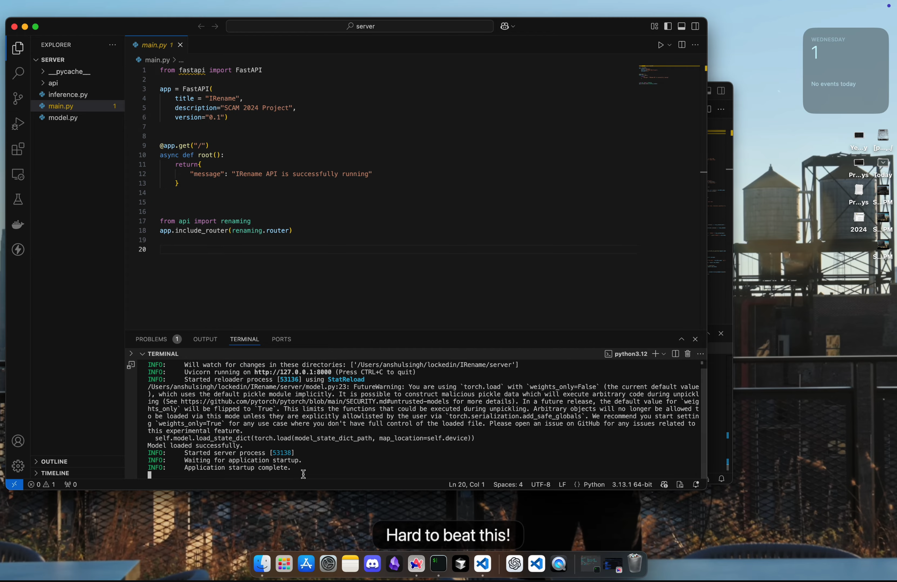

# ReNameIt: (VS Code Extension)


### Walkthrough (VS Code Extension - dev mode)

[](https://youtu.be/hvkGQlqxshU)
## Architecture

The system consists of two main parts:

1. **VS Code Extension (Frontend):** The extension provides the user interface within VS Code, handles user interactions, and communicates with the backend server. (`client` directory)
2. **FastAPI Backend (Server):** The backend exposes a REST API for code analysis and suggestion generation. It loads the fine-tuned GraphCodeBERT model, performs inference, and handles Java code parsing. (`server` directory)

### Detailed Components:

*   **FastAPI Backend (`server` directory):**
    *   Provides the REST API endpoints for code renaming requests.
    *   Handles communication with the core model.
*   **Core Model (`server/model.py`):**
    *   Loads and utilizes the fine-tuned GraphCodeBERT model.
    *   Implements the logic for generating identifier suggestions.
*   **Inference Logic (`server/inference.py`):**
    *   Contains the core functions from the original research paper for generating identifier candidates (`greet`) and selecting the best candidate based on PLL (`meet`).
*   **API Logic (`server/api/renaming.py`):**
    *   Defines the API endpoint (`/rename`) and request/response models.
    *   Handles Java code parsing using `javalang`, identifier occurrence finding, code masking, and calling `model.py` for prediction.

## How it Works (Extension)**

1. **Trigger:** The user can trigger renaming in two ways:
    *   **Manually:**
        *   Select an identifier in a Java file.
        *   Right-click and choose "Rename Identifier (ReNameIt)" from the context menu, or use the associated keybinding (if configured).
        *   Alternatively, place the cursor on an identifier and use the "Refactor" code action (lightbulb icon or `Ctrl+.`).
    *   **Automatically (Optional):**
        *   Enable automatic renaming using the "ReNameIt: Toggle Automatic Renaming" command from the Command Palette.
        *   Suggestions will then appear in a hover when the cursor is placed over an identifier.
2. **Request:** The extension sends the following to the FastAPI server:
    *   The entire Java code of the current file.
    *   The line and character position of the selected identifier.
    *   The desired number of subtokens for the new name (`-1` for automatic mode).
3. **Server-Side Processing:**
    *   **Identifier Location:** The `find_variable_at_position` function in `renaming.py` efficiently locates the identifier and all its occurrences using the `javalang` tokenizer.
    *   **Code Masking:** The `mask_code` function replaces all occurrences of the identifier with `[MASK]` tokens, preparing the code for the model.
    *   **Model Inference:** The masked code is sent to the GraphCodeBERT model for prediction. In automatic mode, the server tries different numbers of `[MASK]` tokens and selects the suggestion with the lowest Pseudo-Perplexity (PLL) using the logic in `inference.py` (`meet` function), which indicates the highest confidence.
4. **Suggestion Display:** The server returns a list of suggested identifier names and their probabilities (or PLL values). The extension then displays these suggestions to the user:
    *   **Manual Mode:** In a QuickPick menu.
    *   **Automatic Mode:** Within a hover popup.
5. **Application:** If the user selects a suggestion, the extension automatically replaces all occurrences of the original identifier with the selected name throughout the current file.

## Installation

### Prerequisites

*   **Node.js and npm:** Install from [https://nodejs.org/](https://nodejs.org/)
*   **Python 3.8+:**  Make sure you have Python 3.8 or higher installed.
*   **VS Code:** Install from [https://code.visualstudio.com/](https://code.visualstudio.com/)
*   **Postman (Optional):** For testing the API directly. Download from [https://www.postman.com/downloads/](https://www.postman.com/downloads/)

### Steps

1. **Clone the Repository:**

    ```bash
    git clone <repository_url>
    cd <repository_directory>
    npm install -g yo generator-code
    ```

2. **Install Backend Dependencies:**

    ```bash
    cd server
    python3 -m venv .venv
    source .venv/bin/activate  # On macOS/Linux
    # .\.venv\Scripts\activate  # On Windows
    pip install -r requirements.txt
    ```

3. **Install Frontend Dependencies:**

    ```bash
    cd ../client
    npm install
    ```

4. **Download the Pretrained Model:**

    *   Download the fine-tuned model state dictionary (`model_26_2`) from the provided source in the original paper or use your own fine-tuned model.
    *   Place the downloaded model file(s) in the `server/model_artifacts/` directory. Ensure the path in `server/model.py` (`load_model` function) is correct.

## Usage

### Running the Backend Server

1. **Navigate to the `server` directory:**
    ```bash
    source .venv/bin/activate  # On macOS/Linux
    # .\.venv\Scripts\activate  # On Windows
    cd server
    ```

2. **Start the server:**
    ```bash
    uvicorn main:app --reload
    ```
    The server will start on `http://127.0.0.1:8000`.

### Running the VS Code Extension (Development Mode)

1. **Open the `client` directory in VS Code:**
    ```bash
    cd ../client
    code .
    ```

2. **Press F5** to start a new **Extension Development Host** window. The ReNameIt extension will be loaded in this window.

3. **Open a Java file** in the Extension Development Host window.

4. **Test the extension:**
    *   **Code Action:** Place your cursor on an identifier and look for the lightbulb icon (or press `Ctrl+.`) to access the "Rename Identifier (ReNameIt)" code action.
    *   **Automatic Renaming (Optional):** Use the Command Palette (`Ctrl+Shift+P` or `Cmd+Shift+P`) to run the "ReNameIt: Toggle Automatic Renaming" command. Then, hover over identifiers to see suggestions.


### Configuration

*   **`renameit.serverUrl`:** Specifies the URL of the FastAPI server. The default is `http://127.0.0.1:8000`. You can change this in your VS Code settings (File > Preferences > Settings, search for "ReNameIt").
*   **`renameit.automaticRenaming`:** Enables or disables automatic renaming suggestions on hover. The default is `false`.

## API Testing (Optional)

You can use tools like `curl` or `Postman` to send POST requests directly to the `/rename` endpoint of the running FastAPI server.

**Example `curl` request:**

```bash
curl -X POST -H "Content-Type: application/json" -d '{
    "code": "public class MyClass {\n    public int myVar = 10;\n    public void myMethod() {\n        int x = myVar + 5;\n        System.out.println(x);\n    }\n}",
    "line": 3,
    "char": 13,
    "num_tokens": -1
}' http://localhost:8000/rename
```

**Expected Response:**

```json
{
    "suggestions": ["<suggested_name>"],
    "probabilities": [<probability_or_pll>]
}
```

## Example (Usage in VS Code)**

**Input Code (in a Java file):**

```java
public class Example {
    public int counter = 0;

    public void increment() {
        counter++;
    }

    public int getCount() {
        return counter;
    }
}
```

**Steps:**

1. Select the identifier `counter` on line 2 (or place your cursor on it).
2. Right-click and choose "Rename Identifier (ReNameIt)" or use the appropriate trigger for a code action or automatic renaming.
3. The extension will send a request to the backend, and you'll see suggestions in a QuickPick menu (or in a hover if automatic mode is enabled).

**Possible Output (in the QuickPick or hover):**

```
value (Probability: 4.56)
count (Probability: 3.81)
...other suggestions...
```
